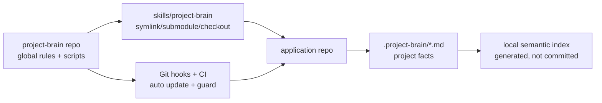
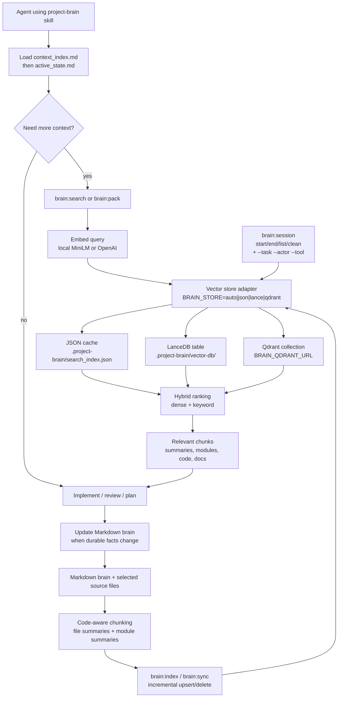

# Project Brain

A reusable agent skill and local semantic memory system for web application development.

This repository is the **global Project Brain package**. It owns shared scripts, templates, guardrails, GitFlow rules, code conventions, and team-memory policy. Application repositories should keep project-specific state in `.project-brain/`.

## Source Of Truth Layers

- Global repo (`project-brain`): reusable conventions, templates, scripts, and guardrails.
- Application repo (`.project-brain/`): project-specific product plan, architecture context, features, modules, decisions, active state, and handoffs.
- Cavemem: optional local personal/session memory. It is not authoritative until promoted into `.project-brain/*.md`.

### Git-native source of truth

- **Canonical facts** live in **Git-tracked** Markdown under `.project-brain/` (root maps, `features/`, `modules/`, `decisions/`, …). **PR review** should treat brain updates like code: missing or misleading context is a defect.
- **Semantic indexes** (JSON mirror, LanceDB, Qdrant) are **local derived caches** from those files plus selected source paths. They speed retrieval; they are not authoritative. After substantive edits, run `npm run brain:sync` (or `brain:maintain`) before trusting search-only answers.

## One-line setup after adding this folder

Place or link this repository at:

```txt
skills/project-brain/
```

Then run:

```bash
bash skills/project-brain/bin/setup.sh
```

For a sibling checkout layout:

```bash
git clone git@github.com:nicenoize/project-brain.git ../project-brain
mkdir -p skills
ln -sfn ../project-brain skills/project-brain
bash skills/project-brain/bin/setup.sh
```

## Updating from upstream

From an app repo: `npm run brain:update-skill` (runs `skills/project-brain/bin/update.sh`). If the skill checkout has no tracking branch, it fetches **https://github.com/nicenoize/project-brain** and fast-forwards `main` (override with `PROJECT_BRAIN_UPSTREAM_URL`, or set `PROJECT_BRAIN_REMOTE=origin` to keep the old “named remote only” behavior).

## What to commit in an application repo

Commit:

```txt
.project-brain/context_index.md
.project-brain/master_plan.md
.project-brain/product_plan.md
.project-brain/repo_context.md
.project-brain/active_state.md
.project-brain/features/
.project-brain/modules/
.project-brain/decisions/
.project-brain/work-packages/
.project-brain/orchestration/
.project-brain/sessions/
.project-brain/eval.json
.project-brain/DECISIONS.md
.project-brain/MODULE_MAP.md
.github/PULL_REQUEST_TEMPLATE.md
.github/workflows/project-brain.yml
```

Do not commit a full fork of this global skill into every app repo unless the project intentionally vendors a pinned copy. Prefer a symlink, package install, submodule, or documented setup path to this canonical repo.

Do not commit:

```txt
.project-brain/vector-db/
.project-brain/index_manifest.json
.project-brain/search_index.json
.project-brain/runner-logs/
.worktrees/
~/.cavemem/
```

## GitFlow Defaults

- `main` is protected production/release.
- `develop` is protected integration.
- Feature/fix/refactor/chore/docs/test branches start from `develop` and target `develop`.
- Work branches should be issue-linked: `feature/123-short-description`.
- Release branches target `main`.
- Hotfix branches start from `main` and must merge back into `develop`.
- PRs close issues with `Closes #123` or `Fixes #123`.

## First Agent Command

```text
Use the project-brain skill. Audit this repository, ingest the master plan if present, update context_index, infer modules/features, and mark uncertain facts as Needs Review.
```

## Token-Saving Mode

Project Brain is designed to pair with the external Caveman skill for low-token agent communication.

Install Caveman once per developer machine:

```bash
curl -fsSL https://raw.githubusercontent.com/JuliusBrussee/caveman/main/install.sh | bash
```

Manual Codex install:

```bash
npx skills add JuliusBrussee/caveman -a codex
```

Recommended team policy:

- Internal agent progress, handoffs, reviews, and investigation notes: use `$caveman ultra`.
- User-facing summaries: stay concise and readable; use normal wording when compression would hide risk or ordering.
- Stop compression for destructive action confirmations, security warnings, or ambiguous multi-step instructions.

Project Brain still keeps durable facts in `.project-brain/*.md`; Caveman only changes how agents communicate.

`npm run brain:guard` warns when `context_index.md` exceeds `BRAIN_CONTEXT_INDEX_WARN_TOKENS` (default 700 estimated tokens). Use `npm run brain:guard -- --strict-context-index` to fail the hook on oversize indexes. `npm run brain:health -- --check-brain-refs` scans `.project-brain/**/*.md` for broken relative links; strict CI runs this via `brain:maintain -- --ci`. `brain:health` also prints **root brain doc ages** (git last commit, else mtime) for `context_index`, `repo_context`, `master_plan`, and `active_state`, warns when `repo_context.md` is older than `package.json` (mtime), and honors **`BRAIN_STALE_DOC_DAYS`** (set to a positive number to warn when any of those files exceed that age).

## Auto-compact (Cursor + terminal agents)

- **`npm run brain:compact`** — writes a bounded resume slice (`brain:pack` budget, default 1200 tokens) to `.project-brain/sessions/…__auto-compact__….md`. Set `BRAIN_TASK`, `BRAIN_ACTOR`, and `BRAIN_TOOL` (`cursor`, `claude`, `gemini`, `codex`, …) when multiple streams share one branch.
- **Vector index:** auto-compact Markdown is **excluded from `brain:index` globbing** by default (`*__auto-compact__*.md`). Embedding the compact into the local vector store is **opt-in**: set `BRAIN_COMPACT_EMBED_INDEX=1` when you explicitly want those rows in semantic search (otherwise rely on the on-disk file + `brain:pack`). Session handoffs from `brain:session` still embed as usual.
- **Retrieval policy:** session paths, `provenance: generated`, `synthetic: true`, and `noindex: true` records are **strongly down-ranked** in hybrid scoring so architecture questions stay anchored on durable brain docs unless `BRAIN_TASK` matches a session chunk.
- **Compact anti-recursion:** `brain:compact` uses resume packing and excludes prior auto-compact snapshots by default, so compact files do not quote older compact files forever. Set `BRAIN_PACK_INCLUDE_AUTO_COMPACT=1` only when you explicitly need old compact text.
- **`npm run brain:install-cursor-hooks`** — installs `.cursor/hooks.json` entries for **`preCompact`** and **`stop`** so compaction runs without manual steps. Re-run after updating the skill; merges with existing hooks when possible.
- **Claude / Codex / Gemini** — run the same `npm run brain:compact` from the repo root before thread reset or long sessions; see `skills/project-brain/templates/agents/COMPACT_INSTRUCTIONS.md`.

### Prune + session digest (durable-memory compaction)

`brain:compact` writes resume slices for the **current** session. The two scripts below shrink the **durable** memory files so every future session starts lighter.

- **`npm run brain:prune`** — moves "Complete (≥30 days ago)" bullets out of `.project-brain/active_state.md` into `.project-brain/history/YYYY-MM.md`, leaving a one-line stub that `brain:ask` can still find. Default is dry-run; pass `--apply` to write, `--with-caveman` to additionally pipe the file through `caveman-compress` (calls Claude — costs tokens). Tunable via `BRAIN_COMPACT_AGE_DAYS` (default `30`). Skips any file with uncommitted changes to avoid clobbering in-flight edits.
- **`npm run brain:digest`** — Claude Code `PreCompact` / `Stop` hook target. Reads the hook JSON payload from stdin (`transcript_path`, `session_id`, `hook_event_name`), scrapes `## Decided:` / `## Memory:` / `## Followup:` lines from the assistant transcript, and appends them to `.project-brain/sessions/YYYY-MM-DD-digest.md`. Always emits `{"continue": true}` so the host workflow proceeds even on script error.

Claude Code wiring (`.claude/settings.json` per project):

```json
{
  "hooks": {
    "PreCompact": [{ "hooks": [{ "type": "command", "command": "npm run -s brain:digest" }] }],
    "Stop":       [{ "hooks": [{ "type": "command", "command": "npm run -s brain:digest" }] }]
  }
}
```

Optional: add `npm run brain:prune` to a weekly cron (or a `prepare-commit-msg` hook with a date-stamped lock file) so `active_state.md` self-trims without manual housekeeping.

## Common commands

```bash
npm run brain:init
npm run brain:update-skill
npm run brain:index
npm run brain:ask -- "auth checkout module"
npm run brain:search -- "auth checkout module"
npm run brain:search -- "auth checkout module" --summary-only
npm run brain:symbol -- QdrantStore QdrantStore
npm run brain:impact -- QdrantStore
npm run brain:pack -- "auth checkout module" --max-tokens 3000
npm run brain:pack -- "auth checkout module" --tight-budget
npm run brain:pack -- "resume current work" --mode resume --max-tokens 1200
npm run brain:pack -- "architecture map" --mode minimal --max-tokens 800
npm run brain:ticket -- "large auth hardening task" --packages 4 --write
npm run brain:ticket -- create "large auth hardening task" --packages 4 --github
npm run brain:orchestrate -- --limit 6 --concurrency 3 --write
npm run brain:work -- start --issue 123 --slug auth-hardening --actor codex --tool codex --files lib/auth.ts
npm run brain:lease -- add "lib/auth.ts" --task issue-123-auth-hardening --actor codex
npm run brain:pr -- prepare --write .project-brain/pr-body.md
npm run brain:session -- start --task issue-123-slug --actor alice --tool human
npm run brain:session -- end --task issue-123-slug
npm run brain:worktree -- spawn --count 3 --base develop --type feature --issue 456 --slug parallel-audit --tool codex
npm run brain:worktree -- list
npm run brain:graph -- --format json
npm run brain:eval
npm run brain:maintain
npm run brain:maintain -- --clean-session-files
npm run brain:maintain -- --ci
npm run brain:compact
npm run brain:install-cursor-hooks
npm run brain:sync
npm run brain:guard
npm run brain:health
npm run brain:adr -- "short decision title"
```

## Agent-ready workflow

For ordinary context lookup, use the router first:

```bash
npm run brain:ask -- "where is auth session validated?"
```

For a normal implementation workstream:

```bash
npm run brain:work -- start --issue 123 --slug auth-hardening --actor codex --tool codex --files lib/auth.ts
# work, update brain docs when durable facts change
npm run brain:compact
npm run brain:pr -- prepare --write .project-brain/pr-body.md
npm run brain:work -- end --task issue-123-auth-hardening
```

For oversized or multi-agent work, split before coding:

```bash
npm run brain:ticket -- "auth billing migration" --packages 4 --files lib/auth.ts,lib/billing.ts --modules auth,billing --write
npm run brain:worktree -- spawn --count 3 --base develop --type feature --issue 123 --slug auth-billing --tool codex
```

For backlog orchestration from GitHub issues:

```bash
npm run brain:orchestrate -- --limit 8 --concurrency 3 --label agent-ready --write --write-packages
npm run brain:orchestrate -- --refill --limit 8 --concurrency 3 --label agent-ready --write
npm run brain:orchestrate -- --watch --interval 120 --concurrency 3 --label agent-ready --write
# optional: add --spawn-worktrees after reviewing the plan
# optional: add --launch-runners with an explicit runner command template
npm run brain:orchestrate -- --refill --concurrency 3 --label agent-ready --spawn-worktrees --launch-runners --runner-cmd 'codex exec {prompt}'
```

`--refill` counts active workstreams in `.project-brain/active_state.md` and only assigns open worker slots. `--watch` keeps polling/refilling until stopped, so finishing a package with `brain:work -- end --task ...` frees a slot for the next issue on the next cycle. When worktrees are spawned, the orchestrator records those assignments in `active_state.md` immediately so the next refill does not duplicate runners before they start their own sessions.

`--launch-runners` starts one detached runner process per spawned worktree. Runner command placeholders are shell-quoted: `{prompt}`, `{task}`, `{actor}`, `{tool}`, `{branch}`, `{issue}`, `{title}`, `{cwd}`. The runner also receives `BRAIN_TASK`, `BRAIN_ACTOR`, `BRAIN_TOOL`, `BRAIN_ISSUE`, `BRAIN_BRANCH`, and `BRAIN_RUNNER_PROMPT` in its environment. Logs default to `.project-brain/runner-logs/`.

Use `brain:lease -- list` before assigning workers and `brain:lease -- add ...` before editing shared files.

Useful retrieval env vars:

```bash
BRAIN_STORE=auto|json|lance|qdrant
BRAIN_QDRANT_URL=http://localhost:6333
BRAIN_QDRANT_COLLECTION=project_brain
BRAIN_QDRANT_API_KEY=
BRAIN_EMBED_PROVIDER=local|openai
BRAIN_OPENAI_EMBED_MODEL=text-embedding-3-small
OPENAI_API_KEY=
BRAIN_HYBRID_ALPHA=0.7
BRAIN_CONTEXT_FILES=app/page.tsx,lib/auth.ts
BRAIN_CHANGED_FILE_BOOST=0.12
BRAIN_ARCH_DOC_BOOST=0.1
BRAIN_TEST_PATH_PENALTY=0.08
BRAIN_CONTEXT_INDEX_WARN_TOKENS=700
BRAIN_PACK_MAX_TOKENS=2600
BRAIN_SESSION_TTL_HOURS=72
BRAIN_TASK=issue-123-slug
BRAIN_ACTOR=cursor-worker-b
BRAIN_TASK_BOOST=0.14
BRAIN_ACTOR_BOOST=0.06
# Optional: exclude auto-compact paths from brain:index (default on); set to 0 to index them
# BRAIN_INDEX_AUTO_COMPACT=0
# Optional: vector-upsert after brain:compact (default off)
# BRAIN_COMPACT_EMBED_INDEX=1
# Optional: filter indexer list with git check-ignore (opt-in)
# BRAIN_INDEX_GITIGNORE=1
# Retrieval tuning (see scripts/retrieval.mjs)
# BRAIN_SLOP_PENALTY=0.12
# BRAIN_ARCH_KEYWORD_SCALE=1.15
# BRAIN_RECENCY_MAX_BOOST=0.06
# Optional default for brain:worktree spawn (--tool overrides): cursor | claude | gemini | codex | …
# BRAIN_WORKTREE_TOOL=cursor
# Warn when key brain root files exceed N days since last git commit (or mtime if untracked)
# BRAIN_STALE_DOC_DAYS=21
# Log brain:pack token usage to stderr (same as --print-budget)
# BRAIN_PACK_PRINT_BUDGET=1
```

`BRAIN_TASK` / `BRAIN_ACTOR` (or `brain:search|pack|ask --task … --actor …`) add a metadata boost so session handoffs and chunks tagged with the same `task_id` / `actor` in frontmatter rank higher—useful when Cursor, Claude, Gemini, or multiple humans work in parallel on one repo.

**Parallel branches (multiple agent sessions):** run `npm run brain:worktree -- spawn --count N [--tool cursor|claude|gemini|codex|…] …` from the app repo root. Open each printed directory in its own session (Cursor, Claude Code, Codex CLI, Gemini, etc.), run `brain:session -- start` there with the suggested `--task`, `<tool>-worker-N` actor, and `--tool`, and use matching `BRAIN_TASK` / `BRAIN_ACTOR` for `brain:pack` / `brain:ask`. Default tool is `claude`; set **`BRAIN_WORKTREE_TOOL`** or **`--tool`** for other stacks. Worktrees default to `<repo>/.worktrees/` (ignored by setup); set `BRAIN_WORKTREE_DIR` or pass `--dir` to place them elsewhere. Run `npm run brain:index` (or `brain:sync`) per worktree if retrieval should reflect that checkout’s files.

**LanceDB upgrade:** if commands fail with Lance “schema” / “fields did not match” errors after pulling a newer Project Brain, delete the local table and rebuild: `rm -rf .project-brain/vector-db && npm run brain:index -- --force`.

## API Keys

Default setup needs no API keys:

| Capability | Default / free path | Paid / hosted path | Env vars |
|---|---|---|---|
| Embeddings | Local `Xenova/all-MiniLM-L6-v2` via `BRAIN_EMBED_PROVIDER=local` | OpenAI embeddings | `OPENAI_API_KEY`, `BRAIN_OPENAI_EMBED_MODEL` |
| Vector store | JSON cache, or local LanceDB files | Hosted/local Qdrant | `BRAIN_STORE`, `BRAIN_QDRANT_URL`, `BRAIN_QDRANT_COLLECTION`, `BRAIN_QDRANT_API_KEY` |
| Token saving | Caveman skill, local install | None required | none |
| Session memory | `.project-brain/sessions/` local Markdown + local index | None required | `BRAIN_SESSION_TTL_HOURS` |

Free defaults:

```bash
BRAIN_EMBED_PROVIDER=local
BRAIN_STORE=auto
```

Free Qdrant alternative:

```bash
docker run -p 6333:6333 qdrant/qdrant
BRAIN_STORE=qdrant BRAIN_QDRANT_URL=http://localhost:6333 npm run brain:index
```

## How it works

- `.project-brain/*.md` files are the source of truth.
- `.project-brain/context_index.md` is the compressed low-token map agents load first.
- `.project-brain/master_plan.md` stores the full plan.
- `npm run brain:sync` keeps the semantic index aligned incrementally: it diffs indexable files against `index_manifest.json` and re-embeds only changed or deleted paths (use `--force` for a full rebuild).
- Retrieval uses LanceDB when `@lancedb/lancedb` is available, Qdrant when `BRAIN_STORE=qdrant`, with the atomic JSON cache as the default-compatible fallback.
- TypeScript/JavaScript files use AST-aware chunking when the optional `typescript` package is installed, with regex fallback.
- Search combines dense vector similarity, keyword relevance (TF–IDF-style, boosted for architectural queries), exact symbol matching, metadata filters, recency (mtime), shallow-path heuristics for `.project-brain/`, and branch/diff boosts. Session and generated content are down-ranked unless task-scoped boosts apply.
- Code records include symbols, exported symbols, symbol kinds, and line ranges for measurable retrieval quality.
- `brain:impact` retrieves definitions, direct callers, callees, tests, decisions, and related chunks for a symbol.
- `brain:graph` exports file/module/feature/decision/symbol/import links for inspection.
- `brain:eval` runs retrieval relevance checks against `.project-brain/eval.json` or built-in smoke cases.
- The pre-commit hook runs guard checks and syncs the index.
- The post-merge and post-checkout hooks run `brain:update-skill` to fast-forward the canonical skill checkout.

## Visualization

See [docs/brain-architecture.md](docs/brain-architecture.md) for the source-of-truth layers, update flow, and CI layout. For a **hand-maintained** service or package map, seed `.project-brain/MODULE_MAP.md` from `templates/brain/MODULE_MAP.md` (`brain:init` copies it when missing). Symbol-index roadmap (tree-sitter, etc.): [docs/roadmap-symbol-index.md](docs/roadmap-symbol-index.md).



### Skill Runtime



## Team workflow

Each team member runs:

```bash
git pull
bash skills/project-brain/bin/setup.sh
npm run brain:update-skill
```

Each developer has their own local semantic index generated from the same shared Markdown brain.

Team members may also install Cavemem for local cross-session recall:

```bash
npm install -g cavemem
cavemem install --ide codex
cavemem install --ide claude-code
cavemem status
cavemem doctor
```

Project Brain remains the shared source of truth.
