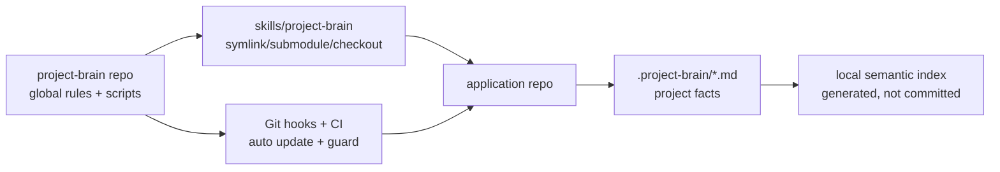
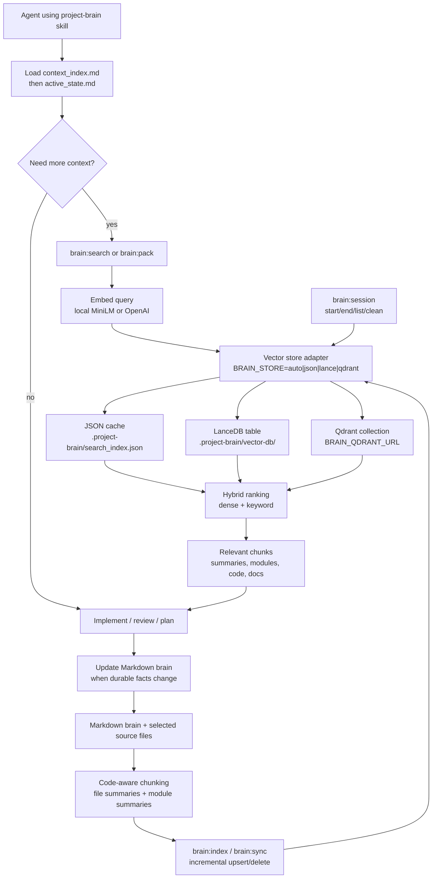

# Project Brain

A reusable agent skill and local semantic memory system for web application development.

This repository is the **global Project Brain package**. It owns shared scripts, templates, guardrails, GitFlow rules, code conventions, and team-memory policy. Application repositories should keep project-specific state in `.project-brain/`.

## Source Of Truth Layers

- Global repo (`project-brain`): reusable conventions, templates, scripts, and guardrails.
- Application repo (`.project-brain/`): project-specific product plan, architecture context, features, modules, decisions, active state, and handoffs.
- Cavemem: optional local personal/session memory. It is not authoritative until promoted into `.project-brain/*.md`.

## One-line setup after adding this folder

Place or link this repository at:

```txt
skills/project-brain/
```

Then run:

```bash
bash skills/project-brain/bin/setup.sh
```

For a sibling checkout layout:

```bash
git clone git@github.com:nicenoize/project-brain.git ../project-brain
mkdir -p skills
ln -sfn ../project-brain skills/project-brain
bash skills/project-brain/bin/setup.sh
```

## What to commit in an application repo

Commit:

```txt
.project-brain/context_index.md
.project-brain/master_plan.md
.project-brain/product_plan.md
.project-brain/repo_context.md
.project-brain/active_state.md
.project-brain/features/
.project-brain/modules/
.project-brain/decisions/
.project-brain/sessions/
.github/PULL_REQUEST_TEMPLATE.md
.github/workflows/project-brain.yml
```

Do not commit a full fork of this global skill into every app repo unless the project intentionally vendors a pinned copy. Prefer a symlink, package install, submodule, or documented setup path to this canonical repo.

Do not commit:

```txt
.project-brain/vector-db/
.project-brain/index_manifest.json
.project-brain/search_index.json
~/.cavemem/
```

## GitFlow Defaults

- `main` is protected production/release.
- `develop` is protected integration.
- Feature/fix/refactor/chore/docs/test branches start from `develop` and target `develop`.
- Work branches should be issue-linked: `feature/123-short-description`.
- Release branches target `main`.
- Hotfix branches start from `main` and must merge back into `develop`.
- PRs close issues with `Closes #123` or `Fixes #123`.

## First Agent Command

```text
Use the project-brain skill. Audit this repository, ingest the master plan if present, update context_index, infer modules/features, and mark uncertain facts as Needs Review.
```

## Token-Saving Mode

Project Brain is designed to pair with the external Caveman skill for low-token agent communication.

Install Caveman once per developer machine:

```bash
curl -fsSL https://raw.githubusercontent.com/JuliusBrussee/caveman/main/install.sh | bash
```

Manual Codex install:

```bash
npx skills add JuliusBrussee/caveman -a codex
```

Recommended team policy:

- Internal agent progress, handoffs, reviews, and investigation notes: use `$caveman ultra`.
- User-facing summaries: stay concise and readable; use normal wording when compression would hide risk or ordering.
- Stop compression for destructive action confirmations, security warnings, or ambiguous multi-step instructions.

Project Brain still keeps durable facts in `.project-brain/*.md`; Caveman only changes how agents communicate.

## Common commands

```bash
npm run brain:init
npm run brain:update-skill
npm run brain:index
npm run brain:search -- "auth checkout module"
npm run brain:search -- "auth checkout module" --summary-only
npm run brain:symbol -- QdrantStore QdrantStore
npm run brain:pack -- "auth checkout module" --max-tokens 3000
npm run brain:session -- start
npm run brain:graph -- --format json
npm run brain:eval
npm run brain:sync
npm run brain:guard
npm run brain:health
```

Useful retrieval env vars:

```bash
BRAIN_STORE=auto|json|lance|qdrant
BRAIN_QDRANT_URL=http://localhost:6333
BRAIN_QDRANT_COLLECTION=project_brain
BRAIN_QDRANT_API_KEY=
BRAIN_EMBED_PROVIDER=local|openai
BRAIN_OPENAI_EMBED_MODEL=text-embedding-3-small
OPENAI_API_KEY=
BRAIN_HYBRID_ALPHA=0.7
BRAIN_CONTEXT_FILES=app/page.tsx,lib/auth.ts
BRAIN_CHANGED_FILE_BOOST=0.12
BRAIN_SESSION_TTL_HOURS=72
```

## API Keys

Default setup needs no API keys:

| Capability | Default / free path | Paid / hosted path | Env vars |
|---|---|---|---|
| Embeddings | Local `Xenova/all-MiniLM-L6-v2` via `BRAIN_EMBED_PROVIDER=local` | OpenAI embeddings | `OPENAI_API_KEY`, `BRAIN_OPENAI_EMBED_MODEL` |
| Vector store | JSON cache, or local LanceDB files | Hosted/local Qdrant | `BRAIN_STORE`, `BRAIN_QDRANT_URL`, `BRAIN_QDRANT_COLLECTION`, `BRAIN_QDRANT_API_KEY` |
| Token saving | Caveman skill, local install | None required | none |
| Session memory | `.project-brain/sessions/` local Markdown + local index | None required | `BRAIN_SESSION_TTL_HOURS` |

Free defaults:

```bash
BRAIN_EMBED_PROVIDER=local
BRAIN_STORE=auto
```

Free Qdrant alternative:

```bash
docker run -p 6333:6333 qdrant/qdrant
BRAIN_STORE=qdrant BRAIN_QDRANT_URL=http://localhost:6333 npm run brain:index
```

## How it works

- `.project-brain/*.md` files are the source of truth.
- `.project-brain/context_index.md` is the compressed low-token map agents load first.
- `.project-brain/master_plan.md` stores the full plan.
- The semantic index is rebuilt locally from committed files and selected source files.
- Retrieval uses LanceDB when `@lancedb/lancedb` is available, Qdrant when `BRAIN_STORE=qdrant`, with the atomic JSON cache as the default-compatible fallback.
- TypeScript/JavaScript files use AST-aware chunking when the optional `typescript` package is installed, with regex fallback.
- Search combines dense vector similarity, keyword relevance, exact symbol matching, metadata filters, and current branch/diff boosts.
- Code records include symbols, exported symbols, symbol kinds, and line ranges for measurable retrieval quality.
- `brain:graph` exports file/module/feature/decision/symbol/import links for inspection.
- `brain:eval` runs retrieval relevance checks against `.project-brain/eval.json` or built-in smoke cases.
- The pre-commit hook runs guard checks and syncs the index.
- The post-merge and post-checkout hooks run `brain:update-skill` to fast-forward the canonical skill checkout.

## Visualization

See [docs/brain-architecture.md](docs/brain-architecture.md) for the source-of-truth layers, update flow, and CI layout.



### Skill Runtime



## Team workflow

Each team member runs:

```bash
git pull
bash skills/project-brain/bin/setup.sh
npm run brain:update-skill
```

Each developer has their own local semantic index generated from the same shared Markdown brain.

Team members may also install Cavemem for local cross-session recall:

```bash
npm install -g cavemem
cavemem install --ide codex
cavemem install --ide claude-code
cavemem status
cavemem doctor
```

Project Brain remains the shared source of truth.
