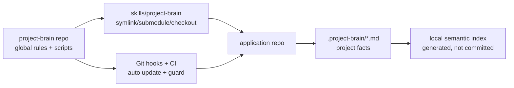

# Project Brain

A reusable agent skill and local semantic memory system for web application development.

This repository is the **global Project Brain package**. It owns shared scripts, templates, guardrails, GitFlow rules, code conventions, and team-memory policy. Application repositories should keep project-specific state in `.project-brain/`.

> **Where to look next:** [`SKILL.md`](SKILL.md) is the canonical reference for commands, retrieval tuning, multi-agent workflow, and conventions. [`docs/brain-architecture.md`](docs/brain-architecture.md) has the data-flow diagrams. [`CONTRIBUTING.md`](CONTRIBUTING.md) covers how to add a new `brain:*` script.

## Source-of-truth layers

- Global repo (`project-brain`): reusable conventions, templates, scripts, and guardrails.
- Application repo (`.project-brain/`): project-specific product plan, architecture context, features, modules, decisions, active state, and handoffs.
- Cavemem: optional local personal/session memory. It is not authoritative until promoted into `.project-brain/*.md`.

**Canonical facts** live in Git-tracked Markdown under `.project-brain/` (root maps, `features/`, `modules/`, `decisions/`, …). **PR review** should treat brain updates like code: missing or misleading context is a defect.

**Semantic indexes** (JSON mirror, LanceDB, Qdrant) are local derived caches from those files plus selected source paths. They speed retrieval; they are not authoritative. After substantive edits, run `npm run brain:sync` (or `brain:maintain`) before trusting search-only answers.

## One-line setup

Place or link this repository at `skills/project-brain/`, then run:

```bash
bash skills/project-brain/bin/setup.sh
```

Sibling-checkout layout (recommended for active skill development):

```bash
git clone git@github.com:nicenoize/project-brain.git ../project-brain
mkdir -p skills
ln -sfn ../project-brain skills/project-brain
bash skills/project-brain/bin/setup.sh
```

Update from upstream: `npm run brain:update-skill`. Without a tracking branch the updater fetches `https://github.com/nicenoize/project-brain` and fast-forwards `main` (override with `PROJECT_BRAIN_UPSTREAM_URL`; set `PROJECT_BRAIN_REMOTE=origin` for the old named-remote behavior).

## What to commit (application repo)

Commit:

```txt
.project-brain/context_index.md
.project-brain/master_plan.md
.project-brain/product_plan.md
.project-brain/repo_context.md
.project-brain/active_state.md
.project-brain/features/
.project-brain/modules/
.project-brain/decisions/
.project-brain/work-packages/
.project-brain/orchestration/
.project-brain/sessions/
.project-brain/eval.json
.project-brain/DECISIONS.md
.project-brain/MODULE_MAP.md
.github/PULL_REQUEST_TEMPLATE.md
.github/workflows/project-brain.yml
```

Prefer a symlink, package install, submodule, or documented setup path to this canonical repo rather than vendoring a full fork into every app repo.

Do not commit:

```txt
.project-brain/vector-db/
.project-brain/index_manifest.json
.project-brain/search_index.json
.project-brain/runner-logs/
.worktrees/
~/.cavemem/
```

## GitFlow defaults

- `main` is protected production/release.
- `develop` is protected integration.
- Feature/fix/refactor/chore/docs/test branches start from `develop` and target `develop`.
- Work branches should be issue-linked: `feature/123-short-description`.
- Release branches target `main`.
- Hotfix branches start from `main` and must merge back into `develop`.
- PRs close issues with `Closes #123` or `Fixes #123`.

Enforced by `brain:guard` (pre-commit). Allowed integration bases include `epic/<issue>-…` for grouped multi-PR work.

## First agent command

```text
Use the project-brain skill. Audit this repository, ingest the master plan if present, update context_index, infer modules/features, and mark uncertain facts as Needs Review.
```

## Token-saving mode

Project Brain pairs with the external **Caveman** skill for low-token agent communication. Install once per developer machine:

```bash
curl -fsSL https://raw.githubusercontent.com/JuliusBrussee/caveman/main/install.sh | bash
```

Recommended policy: `$caveman ultra` for internal agent progress/handoffs/reviews; normal wording for user-facing summaries, destructive-action confirmations, and ambiguous multi-step instructions.

`brain:update-skill` idempotently writes `ultra` to `~/.claude/.caveman-active`. Override with `PROJECT_BRAIN_SKIP_CAVEMAN_ULTRA=1` or by manually picking a non-default mode.

## API keys

Default setup needs no API keys.

| Capability | Default / free path | Paid / hosted path | Env vars |
|---|---|---|---|
| Embeddings | Local `Xenova/all-MiniLM-L6-v2` (`BRAIN_EMBED_PROVIDER=local`) | OpenAI embeddings | `OPENAI_API_KEY`, `BRAIN_OPENAI_EMBED_MODEL` |
| Vector store | JSON cache, or local LanceDB files | Hosted/local Qdrant | `BRAIN_STORE`, `BRAIN_QDRANT_URL`, `BRAIN_QDRANT_COLLECTION`, `BRAIN_QDRANT_API_KEY` |
| Token saving | Caveman skill, local install | None | none |
| Session memory | `.project-brain/sessions/` local Markdown + local index | None | `BRAIN_SESSION_TTL_HOURS` |

Free Qdrant alternative:

```bash
docker run -p 6333:6333 qdrant/qdrant
BRAIN_STORE=qdrant BRAIN_QDRANT_URL=http://localhost:6333 npm run brain:index
```

## Troubleshooting

- **LanceDB schema mismatch after pulling a newer Project Brain.** Manual fix: `rm -rf .project-brain/vector-db && npm run brain:index -- --force`. Or run with `BRAIN_AUTO_RECOVER=1 npm run brain:index` to drop+rebuild automatically.
- **`brain:index` failed in setup.** Re-run `npm run brain:index` directly to see the error; fix the embedder/store config and re-run setup or `brain:index -- --force`.
- **Hooks not firing.** `npm run brain:install-hooks` (Git) and `npm run brain:install-cursor-hooks` (Cursor) are idempotent — re-run after pulling. Verify with `ls -la .git/hooks/`.
- **Stale `context_index.md`.** `npm run brain:guard` warns above `BRAIN_CONTEXT_INDEX_WARN_TOKENS` (default 700 estimated). `npm run brain:health` flags root brain docs older than `BRAIN_STALE_DOC_DAYS`.

## Visualization



See [`docs/brain-architecture.md`](docs/brain-architecture.md) for the runtime data flow (chunk → embed → store → retrieve → rank) and the full hook map. Symbol-index roadmap: [`docs/roadmap-symbol-index.md`](docs/roadmap-symbol-index.md).

## Team workflow

Each team member runs:

```bash
git pull
bash skills/project-brain/bin/setup.sh
npm run brain:update-skill
```

Each developer keeps their own local semantic index generated from the same shared Markdown brain.

Optional: install Cavemem for local cross-session recall:

```bash
npm install -g cavemem
cavemem install --ide codex
cavemem install --ide claude-code
cavemem status
```

Project Brain remains the shared source of truth.

## Development

Tests: `npm test` (uses node's built-in test runner; no extra deps). See [`CONTRIBUTING.md`](CONTRIBUTING.md) for the per-script template and the "no duplicate helpers" rule.
