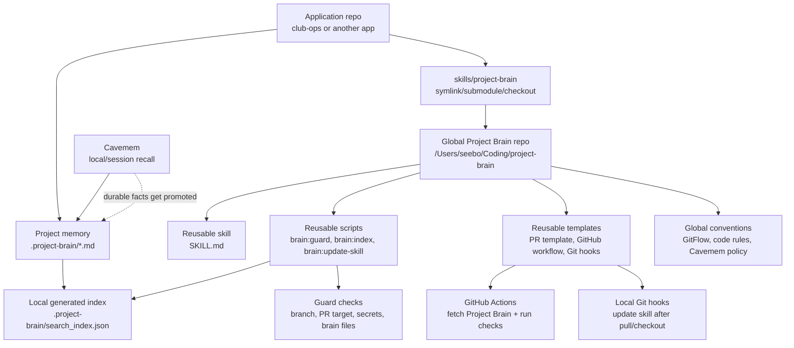
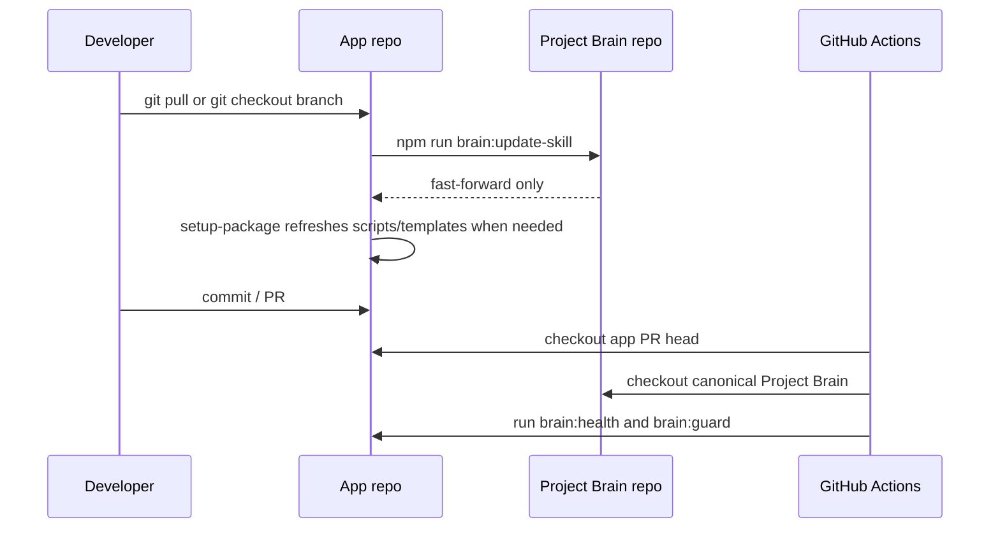

# Project Brain Architecture

Project Brain has one reusable package and many project brains.



## Source Of Truth

- Global Project Brain repo owns reusable skill code, scripts, templates, GitFlow rules, code conventions, and Cavemem policy.
- Application repos own project-specific memory under `.project-brain/`.
- Generated indexes are local caches and are never the source of truth.
- Cavemem is useful personal recall, but shared facts must be promoted into `.project-brain/*.md`.

## Consumer Repo Layout

Recommended app layout:

```txt
app-repo/
  .project-brain/
    active_state.md
    context_index.md
    product_plan.md
    repo_context.md
    decisions/
    features/
    modules/
    sessions/
  skills/
    project-brain -> ../project-brain
  .github/
    PULL_REQUEST_TEMPLATE.md
    workflows/project-brain.yml
```

`skills/project-brain` can be a symlink, Git submodule, mounted checkout, or CI checkout. It should not be a full copied fork unless the app intentionally vendors a pinned version.

## Update Flow



The updater refuses to overwrite local Project Brain changes. Set `PROJECT_BRAIN_UPDATE_STASH=1` only when you explicitly want it to stash local changes before updating.
