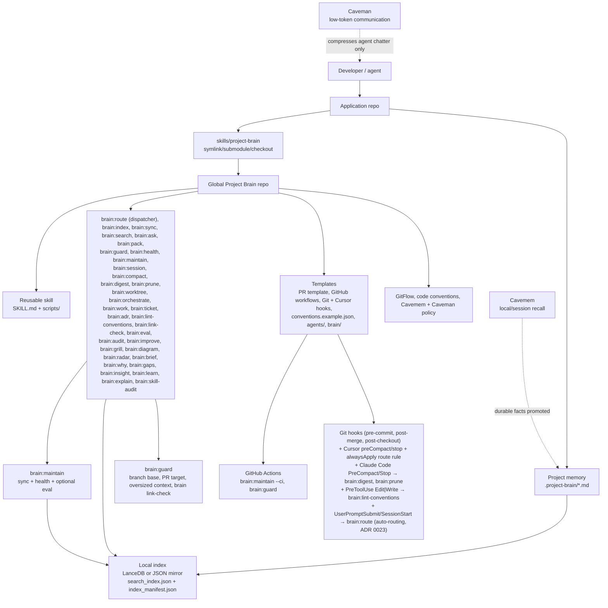
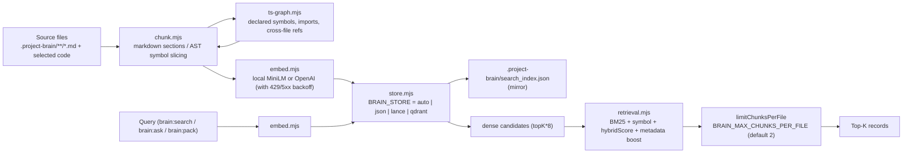
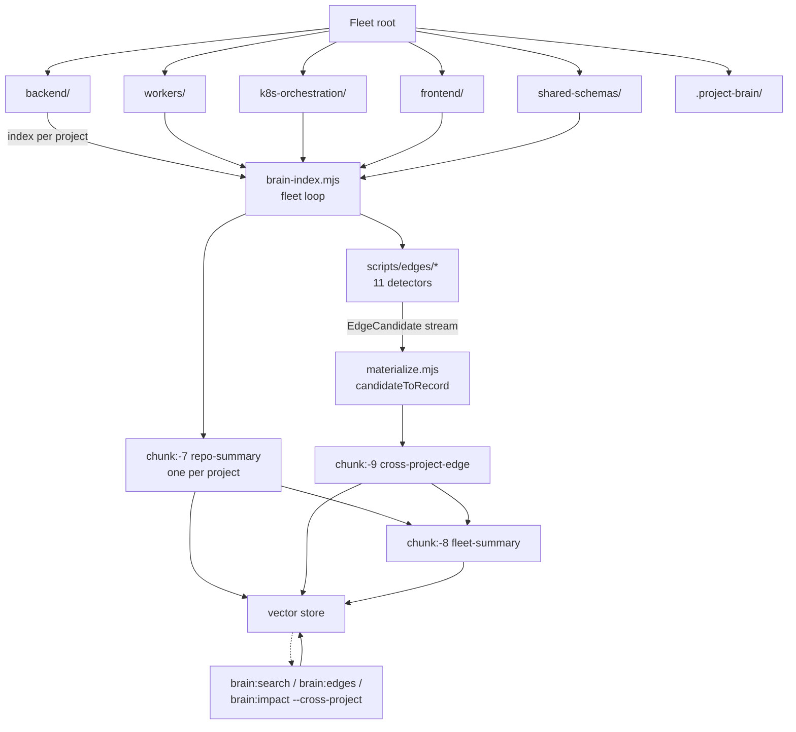
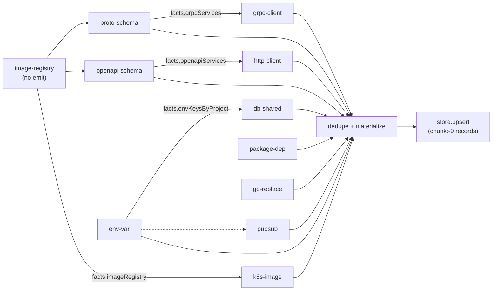
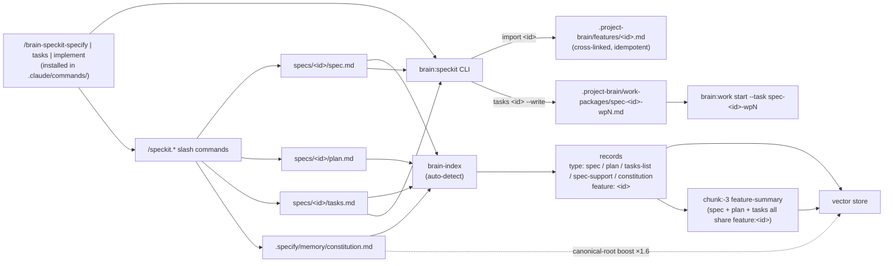
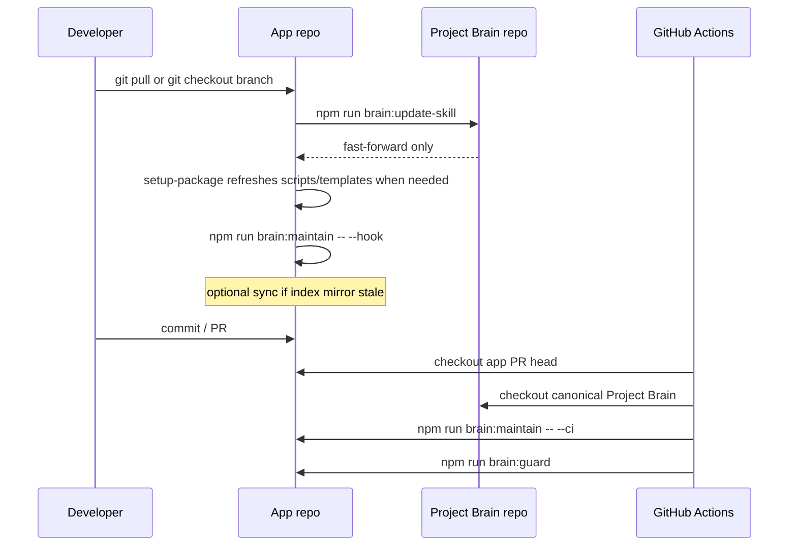

# Project Brain Architecture

Project Brain has one reusable package and many project brains.



## Retrieval data flow



Key invariants:

- `retrieve()` defaults to scoring **only over dense candidates** (the topK*8 returned by the vector store) — not the full corpus. `BRAIN_BROAD_CANDIDATES=1` restores a full scan.
- **Graph-expanded retrieval (`BRAIN_GRAPH_EXPAND=1`, default OFF):** after dense candidates are computed, take the top-N dense seeds (`BRAIN_GRAPH_EXPAND_SEEDS`, default 5) and expand **one hop** over the relationships already on records — `references`↔`symbols`/`exportedSymbols` (mirrors brain-graph's `calls:` edges), shared `imports`, and cross-project edges (`edgeFrom`/`edgeTo`). Neighbor records are merged into the scoring pool (deduped by id, capped at `BRAIN_GRAPH_EXPAND_MAX`, default 12) and scored by the **same** hybrid pipeline plus a small additive graph-proximity bonus (`BRAIN_GRAPH_EXPAND_BONUS`, default 0.08, clamped, applied through the metadata channel so it can't drown a real dense hit). This lets structurally-adjacent records surface even when they don't dense-rank on their own. The expansion logic is the pure exported helper `expandByGraph(seeds, allRecords, opts)`. It is **heavier** than the default path because it requires `store.getAll()` — that call is only made when the flag is set (OFF is byte-for-byte unchanged, no `getAll`). Measure recall on the hard eval subset (`npm run brain:eval`) before considering default-on.
- `hybridScore` is `(α·dense + (1-α)·kw) * (1 + sw·sym) + clamp(metadata, ±0.5)`, capped in `[0, 2]`. Symbol acts as a multiplier so it cannot drown a perfect dense hit.
- Keyword scoring is BM25 (`BRAIN_BM25_K1`, `BRAIN_BM25_B`), not raw TF·IDF.
- Module/feature/project summaries are only rebuilt when a child file under them actually changed (`--force` for a full rebuild).
- `active_state.md` mutations go through `withStateLock` (`.project-brain/.active_state.lock` with PID + ISO timestamp).

### Polyglot symbols (Python + Go)

Precise `symbols` / `exportedSymbols` / `references` come from the TypeScript compiler (`ts-graph.mjs` + the AST path in `chunk.mjs`), so `brain:impact` and `brain:graph` are effectively **TS/JS-only** by default — a Python or Go repo produces no code records and impact/graph see nothing.

`BRAIN_POLYGLOT_SYMBOLS=1` (default **OFF**) turns on a lightweight, pure-JS fallback in `scripts/lang-symbols.mjs` (`extractLiteSymbols(filePath, text)`):

- The file listing in `common.mjs` is widened to include `**/*.py` and `**/*.go` (under the same flag).
- `chunk.mjs` routes those extensions through `chunkLiteCode`, which carries the regex-extracted `symbols`/`exportedSymbols`/`references` on every chunk; the precise TS/JS AST path is left exactly as-is.
- `infer.mjs` maps `.py`/`.go` to `type:code` / `sourceKind:code` (also flag-gated).
- The existing `brain:impact` and `brain:graph` machinery consumes those fields unchanged — definitions, direct callers, and cross-file `calls:` edges resolve for Python/Go symbols with no further changes.

With the flag unset, the indexed file set and every record are **byte-for-byte unchanged**; the intent is to flip default-on after validation. This is the first increment and is regex/heuristic-based (Python exports = top-level `def`/`class`/assignments not prefixed with `_`; Go exports = capitalized identifiers). **tree-sitter precision is the planned follow-up**, replacing the heuristics behind the same `extractLiteSymbols` interface. Known limits today: regexes can miss multi-line/decorated declarations and over- or under-count references vs. a real parser, and `brain:impact`'s callee heuristic (`/^[A-Z]/`) still favors capitalized callees (fine for Go/Python classes, misses lowercase Python function callees — direct callers are unaffected).

## Source Of Truth

- Global Project Brain repo owns reusable skill code, scripts, templates, GitFlow rules, code conventions, Cavemem policy, and Caveman token-budget guidance.
- Application repos own project-specific memory under `.project-brain/`.
- Generated indexes are local caches and are never the source of truth.
- Cavemem is useful personal recall, but shared facts must be promoted into `.project-brain/*.md`.
- Caveman is communication compression only. It does not store facts or replace Project Brain.

## Consumer Repo Layout

Recommended app layout:

```txt
app-repo/
  .project-brain/
    active_state.md
    context_index.md
    product_plan.md
    repo_context.md
    eval.json
    decisions/
    features/
    modules/
    sessions/
  skills/
    project-brain -> ../project-brain
  .github/
    PULL_REQUEST_TEMPLATE.md
    workflows/project-brain.yml
```

`skills/project-brain` can be a symlink, Git submodule, mounted checkout, or CI checkout. It should not be a full copied fork unless the app intentionally vendors a pinned version.

**`eval.json`:** optional but recommended. Holds retrieval smoke cases for `npm run brain:eval` / `brain:maintain -- --ci`. Copy from `skills/project-brain/templates/brain/eval.json` or run `npm run brain:init` (seeds `eval.json` when missing). If absent, CI skips strict eval (see workflow).

## Semantic index lifecycle

| Artifact | Role |
|----------|------|
| `.project-brain/index_manifest.json` | Per-file hashes and chunk id map (gitignored). |
| `.project-brain/vector-db/` | LanceDB table when `BRAIN_STORE` resolves to `lance` (gitignored). |
| `.project-brain/search_index.json` | JSON mirror of rows for health checks and `BRAIN_STORE=json` fallback (gitignored). |

**Sync:** `npm run brain:sync` compares each indexable file’s content hash to `index_manifest.json` and runs `brain-index` with **`BRAIN_CHANGED_FILES` / `BRAIN_DELETED_FILES`** so only changed or removed paths are re-embedded (incremental by default). **`npm run brain:sync -- --force`** always invokes `brain-index --force` for a full rebuild. There is no separate `BRAIN_INDEX_INCREMENTAL` flag: a second sync-state format would duplicate the manifest without adding safety.

**Deferred / risky:** “Incremental” modes that skip manifest comparison or omit deletes can leave ghost rows; teams should rely on the manifest + sync pipeline above until a spec-backed design exists.

**Deletes:** Index rows whose `file` no longer appears in the indexable glob set are removed even when that path was omitted from the manifest (for example, removed session markdown that never had stable manifest ids).

**Mirror consistency:** When using Lance (or Qdrant) with the JSON mirror enabled, `store.close()` after indexing rewrites `search_index.json` from the live table so `brain:health` does not see ghost paths that were already dropped from Lance.

**Automation:** `npm run brain:maintain` runs sync when the mirror reports stale hashes or missing files, then `brain:health`. Flags `--strict`, `--ci`, and `--hook` are documented in root `SKILL.md` and `README.md`.

**Auto-compact:** `npm run brain:compact` writes a bounded resume slice under `.project-brain/sessions/` and indexes it. Cursor hooks (`npm run brain:install-cursor-hooks`) attach to `preCompact` and `stop`; other agents run the same command from the shell (see `templates/agents/COMPACT_INSTRUCTIONS.md`).

## Multi-actor coordination

The same Markdown brain is shared by **humans**, **Cursor agents**, **Claude**, **Gemini**, and CI. Retrieval stays local per machine; coordination is Git + conventions.

| Mechanism | Role |
|-----------|------|
| `active_state.md` | Team radar: workstreams table, optional **file leases**, blockers, overlaps. Prefer a **single merge point** (one human or lead agent) to avoid constant conflicts. |
| `.project-brain/sessions/*.md` | Short-lived handoffs. Start with `npm run brain:session -- start --task <id> --actor <label> --tool cursor\|claude\|gemini\|codex\|human\|other`; end with `end --task <id>`. Filenames include branch + task + timestamp so parallel streams on one branch do not clobber each other. |
| Frontmatter on sessions | `task_id`, `actor`, `tool`, `parent_run` are indexed on chunk records for **task/actor boosts** in hybrid search. |
| `BRAIN_TASK` / `BRAIN_ACTOR` or CLI flags | Passed into `brain:search`, `brain:pack`, and `brain:ask` so packing for a sub-agent favors its own session text. |
| `npm run brain:worktree` | Spawns Git worktrees with GitFlow branch names (`spawn --count N`, optional `--base`, `--issue`, `--slug`, `--tool` or `BRAIN_WORKTREE_TOOL`). Each worker should use one checkout only; run `brain:session` in that directory with the suggested `--task`, `<tool>-worker-N` actor, and `--tool` (Cursor, Claude, Codex, Gemini, …). |

**Parallel directories:** Git worktrees isolate working files per branch; brain Markdown still merges through Git. Rebuild the local semantic index in each worktree (`npm run brain:index` or `brain:sync`) if retrieval must reflect that tree’s files.

**Orchestrator pattern:** a parent agent runs `brain:pack` once (with task/actor set), distributes the blob to workers, collects edits, and one actor merges durable updates into features/modules/decisions plus `active_state.md`.

**LanceDB note:** coordination fields live on index records. If a `brain:session` or index upsert fails with a Lance schema mismatch after upgrading this package, remove `.project-brain/vector-db/` and run `npm run brain:index -- --force` once per machine (see root `README.md`).

## Fleet Mode (multi-project brain)

When `discoverProjects(ROOT)` detects ≥ 2 sibling projects, fleet mode auto-activates. One brain spans the whole fleet; every record carries `project: <name>`; cross-project relationships materialize as `chunk:-9 cross-project-edge` records.



Detector pipeline (order matters — registrars first, consumers after):



See `modules/fleet.md` and ADRs `0009`–`0011` for activation rules, detector contract, and per-project coordination.

## Spec-Kit integration

When a repo uses [`github/spec-kit`](https://github.com/github/spec-kit), brain becomes a downstream consumer of its artifacts. Activation is automatic when `.specify/` or `specs/<id>/` exists.



See `modules/spec-kit.md` and ADR `0012-spec-kit-integration` for activation rules, CLI surface, and the additive-overlay rationale.

## Update Flow



The updater refuses to overwrite local Project Brain changes. Set `PROJECT_BRAIN_UPDATE_STASH=1` only when you explicitly want it to stash local changes before updating.
