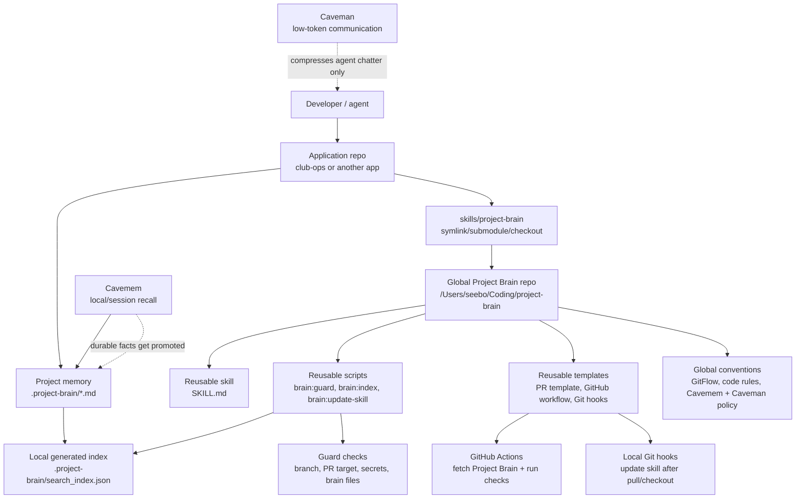
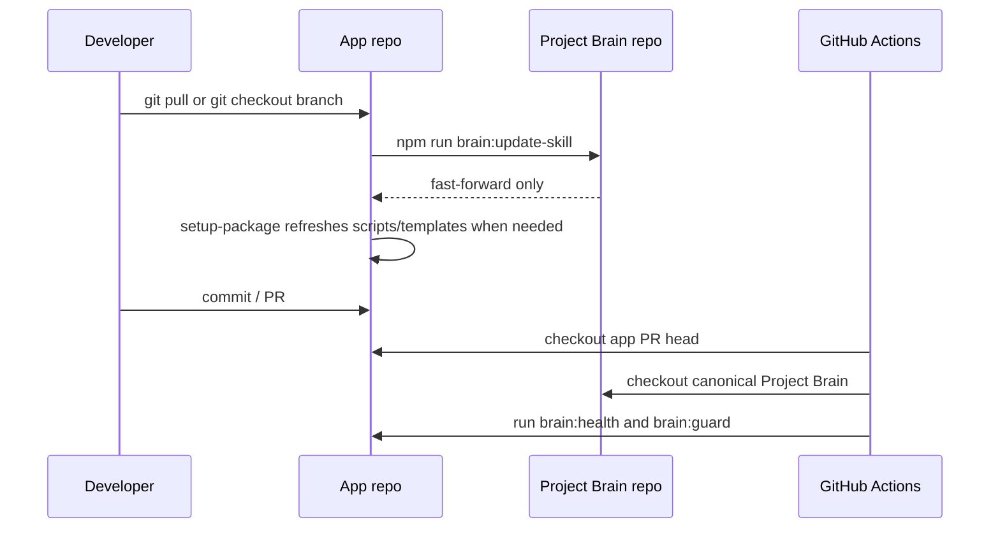

# Project Brain Architecture

Project Brain has one reusable package and many project brains.



## Source Of Truth

- Global Project Brain repo owns reusable skill code, scripts, templates, GitFlow rules, code conventions, Cavemem policy, and Caveman token-budget guidance.
- Application repos own project-specific memory under `.project-brain/`.
- Generated indexes are local caches and are never the source of truth.
- Cavemem is useful personal recall, but shared facts must be promoted into `.project-brain/*.md`.
- Caveman is communication compression only. It does not store facts or replace Project Brain.

## Consumer Repo Layout

Recommended app layout:

```txt
app-repo/
  .project-brain/
    active_state.md
    context_index.md
    product_plan.md
    repo_context.md
    decisions/
    features/
    modules/
    sessions/
  skills/
    project-brain -> ../project-brain
  .github/
    PULL_REQUEST_TEMPLATE.md
    workflows/project-brain.yml
```

`skills/project-brain` can be a symlink, Git submodule, mounted checkout, or CI checkout. It should not be a full copied fork unless the app intentionally vendors a pinned version.

## Multi-actor coordination

The same Markdown brain is shared by **humans**, **Cursor agents**, **Claude**, **Gemini**, and CI. Retrieval stays local per machine; coordination is Git + conventions.

| Mechanism | Role |
|-----------|------|
| `active_state.md` | Team radar: workstreams table, optional **file leases**, blockers, overlaps. Prefer a **single merge point** (one human or lead agent) to avoid constant conflicts. |
| `.project-brain/sessions/*.md` | Short-lived handoffs. Start with `npm run brain:session -- start --task <id> --actor <label> --tool cursor\|claude\|gemini\|codex\|human\|other`; end with `end --task <id>`. Filenames include branch + task + timestamp so parallel streams on one branch do not clobber each other. |
| Frontmatter on sessions | `task_id`, `actor`, `tool`, `parent_run` are indexed on chunk records for **task/actor boosts** in hybrid search. |
| `BRAIN_TASK` / `BRAIN_ACTOR` or CLI flags | Passed into `brain:search`, `brain:pack`, and `brain:ask` so packing for a sub-agent favors its own session text. |
| `npm run brain:worktree` | Spawns Git worktrees with GitFlow branch names (`spawn --count N`, optional `--base`, `--issue`, `--slug`, `--tool` or `BRAIN_WORKTREE_TOOL`). Each worker should use one checkout only; run `brain:session` in that directory with the suggested `--task`, `<tool>-worker-N` actor, and `--tool` (Cursor, Claude, Codex, Gemini, …). |

**Parallel directories:** Git worktrees isolate working files per branch; brain Markdown still merges through Git. Rebuild the local semantic index in each worktree (`npm run brain:index` or `brain:sync`) if retrieval must reflect that tree’s files.

**Orchestrator pattern:** a parent agent runs `brain:pack` once (with task/actor set), distributes the blob to workers, collects edits, and one actor merges durable updates into features/modules/decisions plus `active_state.md`.

**LanceDB note:** coordination fields live on index records. If a `brain:session` or index upsert fails with a Lance schema mismatch after upgrading this package, remove `.project-brain/vector-db/` and run `npm run brain:index -- --force` once per machine (see root `README.md`).

## Update Flow



The updater refuses to overwrite local Project Brain changes. Set `PROJECT_BRAIN_UPDATE_STASH=1` only when you explicitly want it to stash local changes before updating.
